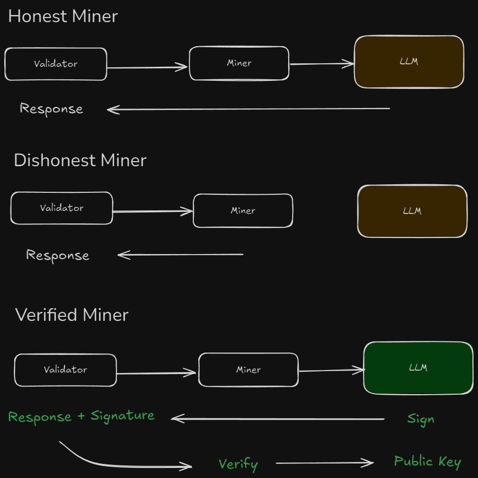

# Verified 🤝 Inference

Trust but verify.

A simple FastAPI proxy for chat/completitons with ed25519 signing and Bittensor metagraph integration

Miners can opt-in and proxy their LLM requests through a verifier, which will forward their request to the defined provider and respond back with a signed response + proof.
The response with proof is submitted to the querying Validator who can independently verify the proof and adjust rewards if applicable.

## Trusted Inference



## Known Limitations

- local miners are excluded from this implementation 
- ed25519 keys are ephemeral

## Configure Environment

### `.env` (server)
```
B64_PRIVATE_KEY=ed25519 key
DATABASE_URL=postgres db
```

### `/tests/.env` (testing)
```
OPENROUTER_KEY=sk-or-v1-xxxxx
OPENAI_KEY=sk-xxxxx
HOTKEY=your-miner-hotkey
```

## Run
```bash
uv sync
uv run uvicorn app.main:app
```

## Test
start the server first then:
```bash
uv run pytest
```

## Endpoints
Server runs on `http://127.0.0.1:8000`
* `GET /` - root
* `GET /health` - health
* `GET /log` - verified log
* `GET /providers` - provider pings
* `GET /public_key` - public key
* `GET /is_verified` - miner verified lookup
* `POST /v1/chat/completions` - Proxy endpoint

## License

MIT
